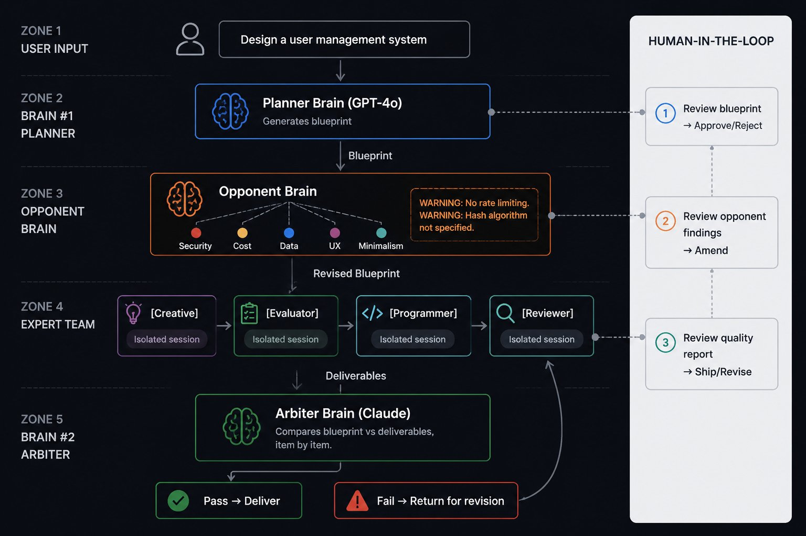

# IMAGE_SPEC.md

## Info Image for README — Architecture Diagram

### Purpose
This image replaces the placeholder in README (line ~35). It should communicate the dual-brain adversarial workflow at a glance — someone scrolling through should understand the concept in 5 seconds without reading text.

### Image Requirements
- **Dimensions**: 1200 x 800 pixels (or 2400 x 1600 for retina)
- **Format**: PNG with transparency, or SVG
- **Background**: Dark (#0D1117, matching GitHub dark mode) or transparent
- **Style**: Clean, geometric, tech-diagram aesthetic. Think Stripe/Linear/Vercel documentation diagrams. No clipart, no emoji, no cartoon characters.

---

## Diagram Layout

### Top-to-bottom flow with 5 horizontal zones:

```
ZONE 1: USER INPUT
   [ "Design a user management system" ]
   A speech bubble or input box, centered. Simple. Human icon on the left.

ZONE 2: BRAIN #1 — PLANNING
   [ Brain #1 icon + label: "Planner Brain (GPT-4o)" ]
   Sub-label: "Analyzes requirements. Generates blueprint."
   Output arrow pointing down with label: "Blueprint"

ZONE 3: OPPONENT BRAIN — CHALLENGE
   [ Brain icon (different color) + label: "Opponent Brain" ]
   Sub-label: "5 adversarial perspectives: Security, Cost, Data, UX, Minimalism"
   Visually: 5 small colored dots/badges branching from the brain icon
   Output bubble showing: "WARNING: Password hashing not specified. WARNING: No rate limiting."
   Arrow pointing to ZONE 4 with label: "Revised Blueprint"

ZONE 4: EXPERT TEAM — EXECUTION
   Horizontal row of 4 connected boxes:
   [ Creative ] -> [ Evaluator ] -> [ Programmer ] -> [ Reviewer ]
   Each box shows: icon + label + "Isolated session" badge
   Visual cues: each box has a different accent color, with arrows showing data flow
   Output arrow pointing down with label: "Deliverables"

ZONE 5: BRAIN #2 — ARBITRATION
   [ Brain #2 icon + label: "Arbiter Brain (Claude)" ]
   Different color from Brain #1 — emphasize "different model"
   Sub-label: "Compares blueprint vs deliverables. Item by item."
   Two possible output paths, side by side:
     Left (green):  [ Pass -> Deliver ]
     Right (amber): [ Fail -> Return for Revision ]
   The "Fail" path has a curved arrow going back up toward ZONE 4

SIDEBAR (right side, vertical):
   A vertical band labeled "YOU" or "HUMAN-IN-THE-LOOP"
   Three approval gates marked:
     [1] Review blueprint → Approve/Reject
     [2] Review opponent findings → Amend plan
     [3] Review final quality report → Ship or revise
   Connected by dotted lines to zones 2, 3, and 5
```

---

## Color Palette

| Element | Color | Hex |
|---------|-------|-----|
| Background | Dark gray (GitHub dark) | #0D1117 |
| Brain #1 (Planner) | Blue | #58A6FF |
| Opponent Brain | Amber / Orange | #F0883E |
| Expert boxes | Muted purple/green/cyan | #7C5CFC / #3FB950 / #39D2C0 |
| Brain #2 (Arbiter) | Green | #3FB950 |
| User / Human-in-loop | White / light gray | #F0F6FC |
| Arrows / connectors | Subtle gray | #30363D |
| Warning text | Amber | #F0883E |
| Pass indicator | Green | #3FB950 |
| Fail indicator | Red | #F85149 |
| Text labels | Light gray | #C9D1D9 |

---

## Typography

- Use a clean monospace or sans-serif font
- Labels: 14-16px, uppercase or title case
- Sub-labels: 12px, muted color
- Brain names: bold, 16px, accent colors
- Connector labels: 11px, italic, #8B949E

---

## Visual Style Reference

Think of these references for aesthetic direction:
- **Linear** feature announcement diagrams (clean geometry, soft gradients, minimal decoration)
- **Vercel** architecture diagrams (dark background, bright accent dots, precise alignment)
- **GitHub** Octicons style for icons (simple, geometric, recognizable)
- No realistic 3D renders. No skeuomorphism. Flat design with subtle depth.

---

## What NOT to include

- No stock photos or photorealistic human figures
- No emoji
- No clipart-style illustrations
- No gradient-heavy "AI art" aesthetic
- No text-heavy paragraphs — this is a diagram, labels should be short

---

## Usage After Generation

1. Save the image as `docs/img/architecture.png`
2. In README.md, replace the placeholder line (~35):
   ```
   <!-- TODO: Replace with info image — see IMAGE_SPEC.md for specifications -->
   <p align="center"><em>[ Architecture diagram placeholder — info image coming soon ]</em></p>
   ```
   with:
   ```
   <p align="center">
     
   </p>
   ```
