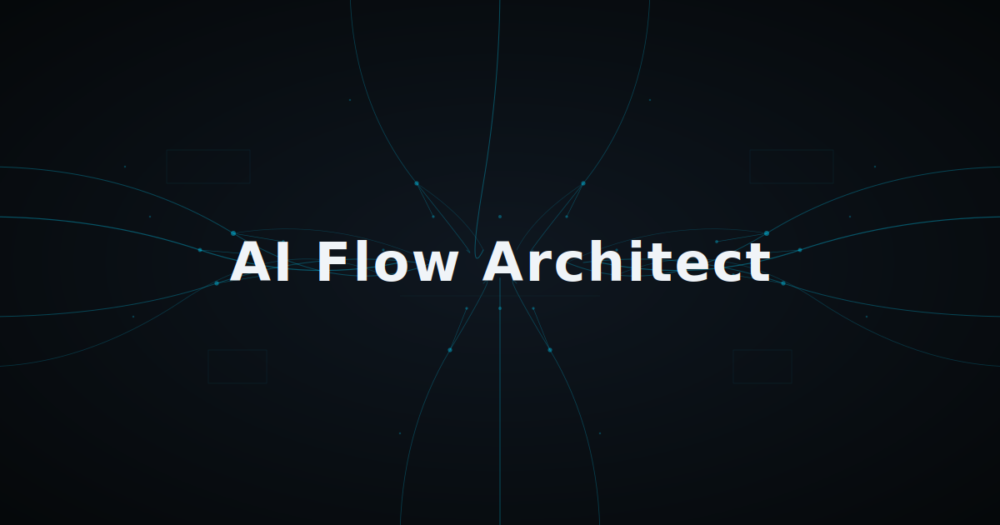
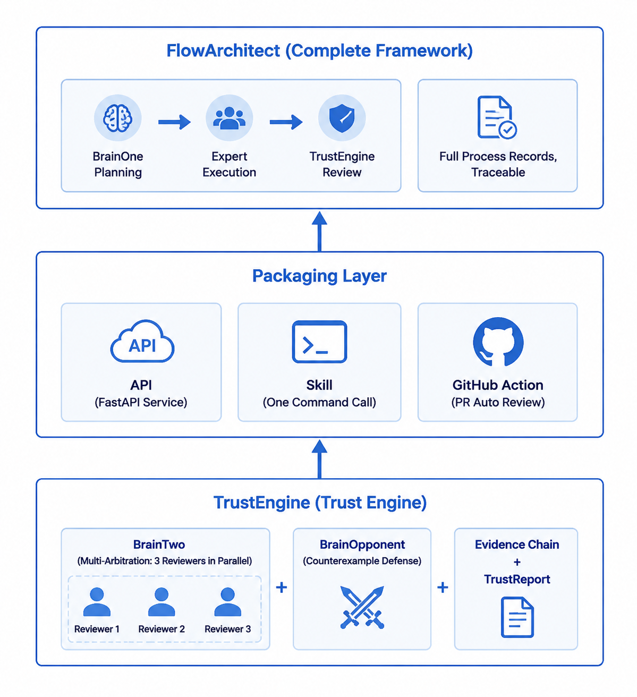
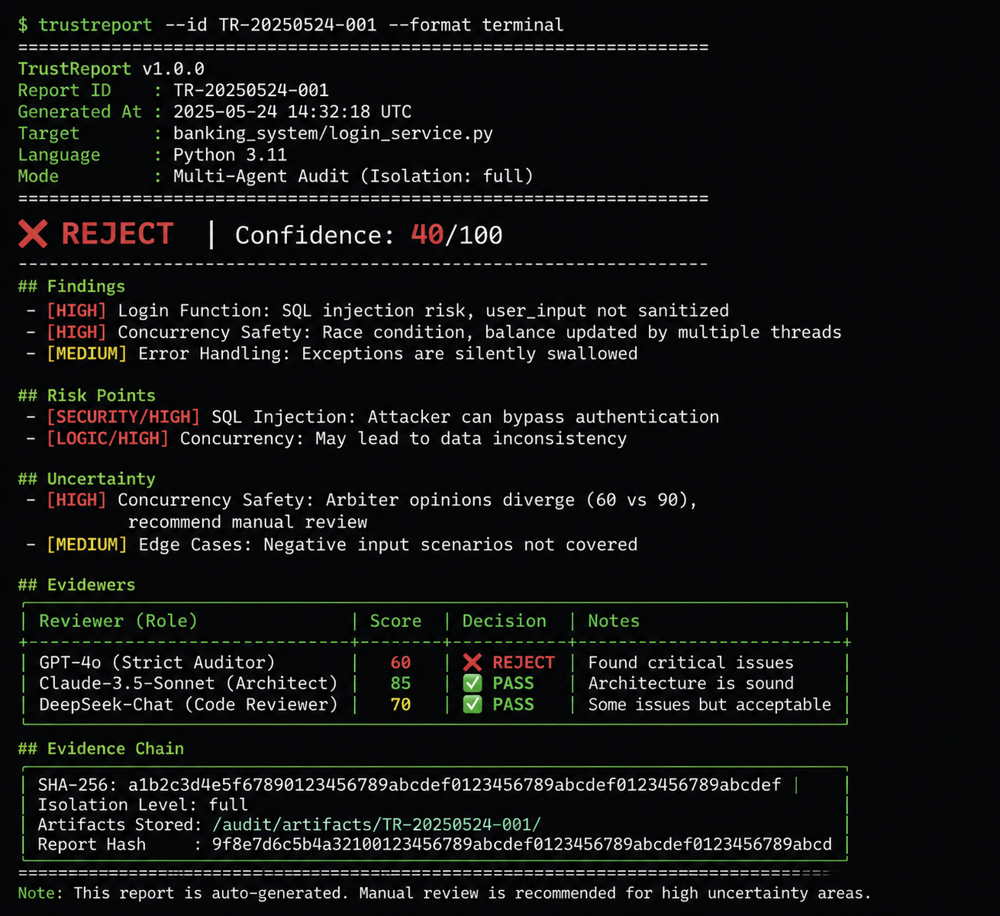

<p align="center">
  
</p>

<p align="center">
  <h1>AI proposes. You decide.</h1>
</p>

<p align="center">
  <strong>I don't trust AI.<br>
  One model saying something is right — that's not proof. Two isolated brains,
  running on different models, debating each other. A third brain arbitrating.
  <em>That</em> barely qualifies.<br><br>
  Every framework out there helps you run more AI.<br>
  This one helps you trust it less.</strong>
</p>

<p align="center">
  <a href="https://www.python.org/downloads/"></a>
  <a href="LICENSE"></a>
  <a href="CHANGELOG.md"></a>
  <a href="https://github.com/wdnmd1265/ai-flow-architect/actions"></a>
</p>

<p align="center">
  <a href="#the-problem">The Problem</a> &middot;
  <a href="#how-it-works">How It Works</a> &middot;
  <a href="#comparison">Comparison</a> &middot;
  <a href="#quick-start">Quick Start</a> &middot;
  <a href="#roadmap">Roadmap</a>
</p>

---

<!-- Ecosystem Architecture -->
<p align="center">
  
</p>

<p align="center"><em>TrustEngine (core) → Packaging Layer (integration) → FlowArchitect (full framework)</em></p>

---

## The Problem

You ask GPT-4 to design a user authentication system. It returns code that looks clean. You scan through it — APIs, database schema, middleware. Looks fine. You ship it.

**What you didn't notice**: the password hashing uses MD5 and there is no rate limiting on login endpoints.

You trusted a single AI and it hallucinated security. This happens constantly — not because AI is malicious, but because **a single model has no mechanism to catch its own blind spots**.

| Existing approach | The flaw |
|---|---|
| Single-model prompting | Same model reviews its own output. Blind spots persist. |
| LangChain / CrewAI | Flexible orchestration, but quality control is your responsibility. |
| "Trust me bro" | Hoping the model gets it right this time. |

## How It Works

### Full Framework: FlowArchitect

Run your task through **two independent AI brains** with built-in adversarial review:

```
  You: "Design a user management system"
         |
         v
+--------------------+
| Brain #1 (Planner) |  Analyzes requirements, generates a step-by-step blueprint
| Model: GPT-4o      |  with risk annotations and alternative approaches
+--------+-----------+
         |
         v
+--------------------+
| Opponent Brain     |  Challenges the blueprint from adversarial perspectives:
| (5 review styles)  |  Security audit, cost analysis, user empathy, data rigor, minimalism
+--------+-----------+
         |
    [You review and approve the blueprint]
         |
         v
+--------------------+
| Expert Team        |  Each expert runs in an isolated session.
| Creative           |  No cross-contamination. Structured handoffs only.
| Evaluator          |
| Programmer         |
| Reviewer           |
+--------+-----------+
         |
         v
+--------------------+
| Brain #2 (Arbiter) |  Compares the blueprint against deliverables item-by-item.
| Model: Claude      |  Cross-model review. Different model = different blind spots.
+--------+-----------+
         |
         v
     You get: a quality report, not a gamble.
```

### Standalone: TrustEngine

Don't need the full framework? Use **TrustEngine** directly — a pure audit layer with zero state, zero interaction:

```python
from ai_flow_architect import TrustEngine, AuditContext

engine = TrustEngine(brain2="claude-3-5-sonnet")
report = engine.audit(
    requirement="Implement password reset with rate limiting",
    ai_output=generated_code,
    context=AuditContext(
        project_path="./src",
        language="python",
        description="User authentication module"
    )
)

print(report.verdict)      # "pass" | "review" | "reject"
print(report.confidence)   # 0-100
print(report.uncertainty)  # What the engine admits it doesn't know
```

**What you get:**

<p align="center">
  
</p>

- **Verdict** with confidence score
- **Findings** — specific issues with severity
- **Risk Points** — security/logic/performance risks
- **Uncertainty** — the engine's honest admission of its own limits
- **Multi-arbiter votes** — cross-model consensus (or divergence)
- **Evidence chain** — SHA-256 hashed, timestamped, auditable

**Key design decisions:**

- **Single key works out of the box.** Omit brain2 and it auto-selects a cheaper model from the same provider. One OpenAI key is enough to start.
- **Cross-provider is best.** OpenAI + Anthropic gives the strongest arbitration — different training data, different failure modes.
- **Different models matter.** Same-model self-review lets hallucinations through. The framework enforces model diversity for Brain #2.
- **Fixed workflow, not free orchestration.** You trade flexibility for predictability. Every task follows the same quality-controlled pipeline.
- **Every expert is session-isolated.** They don't know about each other. Data passes through structured fields only.
- **Opponent Brain before execution.** Five adversarial perspectives challenge the plan before a single API call is wasted.
- **TrustEngine: audit anything, anywhere.** Drop the `engine.audit()` call into your existing pipeline — no framework lock-in.

## Comparison

| | AI Flow Architect | LangChain | CrewAI |
|---|---|---|---|
| **Philosophy** | Adversarial quality control | Flexible pipeline composition | Role-based agent teams |
| **Quality control** | Built-in (dual-brain arbitration + opponent review) | Manual — your responsibility | Optional |
| **Single API key** | Works out of the box | Works | Works |
| **Model isolation** | Auto-enforced (brain2 auto-resolves to different model) | Not enforced | Not enforced |
| **Token saving** | 4 mechanisms, zero-config | Manual optimization | Manual optimization |
| **Flow control** | Fixed 3-phase pipeline with user approval gate | Free-form chains/agents | Configurable process |
| **Best for** | Auditable quality. You need to trust the output. | Maximum flexibility. You own the pipeline. | Multi-agent simulations. |
| **Integration** | Three tiers: Skill → API → Full framework | Framework-first | Framework-first |

If you need maximum flexibility, use LangChain or CrewAI. If you need **auditable quality where AI hallucinations have consequences** — or just want to drop a `trust_engine.audit()` call into your existing code — this is it.

## Model Support

### Production-tested

| Provider | Models | API Key |
|----------|--------|---------|
| **OpenAI** | gpt-4o, gpt-4o-mini, gpt-4-turbo, gpt-3.5-turbo | `OPENAI_API_KEY` |
| **Anthropic** | claude-3-5-sonnet-20241022, claude-3-5-haiku-20240620, claude-3-opus | `ANTHROPIC_API_KEY` |

### Community-ready (OpenAI-compatible protocol — needs your verification)

These providers expose OpenAI-compatible APIs. The framework already supports them through `models.yaml` configuration. If you test one and it works, a PR moving it to "Production-tested" is more than welcome.

| Provider | Models | API Key | Status |
|----------|--------|---------|--------|
| **DashScope (Alibaba)** | qwen-max, qwen-plus, qwen-turbo | `DASHSCOPE_API_KEY` | Needs verification |
| **Zhipu GLM** | glm-4, glm-4-flash, glm-3-turbo | `ZHIPU_API_KEY` | Needs verification |
| **Moonshot** | moonshot-v1-8k, moonshot-v1-32k, moonshot-v1-128k | `MOONSHOT_API_KEY` | Needs verification |
| **DeepSeek** | deepseek-chat, deepseek-coder | `DEEPSEEK_API_KEY` | Needs verification |
| **Ollama (local)** | llama3, qwen2.5-coder, ... | None required | Needs verification |
| **Custom API** | custom-model | `CUSTOM_API_KEY` + `CUSTOM_BASE_URL` | Needs verification |

**Adding a new provider takes 3 steps in `models.yaml`** — no Python code changes needed:
1. Add provider config (base_url, api_key_env)
2. Add model entries (name, context_window, pricing)
3. Add fallback paths

See `models.yaml` for the full configuration structure.

## Token-Saving Mechanisms

All four work out of the box, zero configuration:

| Mechanism | How | Cost |
|-----------|-----|------|
| **Semantic cache** | Same expert+task combo hits cache, skips API call | 0 API calls |
| **Context compression** | History exceeds threshold -> auto-compress | ~60% fewer input tokens |
| **Local rule precheck** | Empty task / unknown expert / invalid complexity — rejected before any API call | 0 cost |
| **Smart skip** | Current step fails -> skip remaining; all remaining are `low` complexity -> skip; explicit `skip_next` flag | 0 API calls |

## Quick Start

### 1. Install

```bash
git clone https://github.com/wdnmd1265/ai-flow-architect.git
cd ai-flow-architect
pip install -e .
```

### 2. Configure

```bash
cp .env.example .env
```

**Single key (works out of the box):**
```bash
OPENAI_API_KEY=sk-your-key
# brain2 auto-selects gpt-4o-mini — one API key is enough to start
```

**Dual key (recommended for best quality):**
```bash
OPENAI_API_KEY=sk-your-key
ANTHROPIC_API_KEY=sk-ant-your-key
# brain2 uses a Claude model — cross-provider arbitration is most effective
```

### 3. Run

```python
import asyncio
from ai_flow_architect import FlowArchitect

async def main():
    # Single key: brain2 auto-resolves to gpt-4o-mini
    # Dual key: brain2 defaults to your Anthropic model
    architect = FlowArchitect(config={
        "brain1": "gpt-4o",
        # "brain2": optional — auto-selected if omitted
    })

    result = await architect.run("Design a user management system")

    if result["status"] == "success":
        print(f"Quality score: {result['audit_result'].get('score', 'N/A')}/100")
    else:
        for s in result.get("revision_suggestions", []):
            print(f"  - {s}")

asyncio.run(main())
```

### 4. What happens at runtime

```
============================================================
Task Blueprint
============================================================
Task ID: task_20260518_001
Description: Design a user management system
Estimated tokens: 5000

Steps:
  1. Requirements analysis [expert: evaluator]
     Task: Analyze functional and non-functional requirements...
  2. Architecture design [expert: creative]
     Task: Design system architecture and technical approach...
  3. Implementation [expert: programmer]
     Task: Implement core user management features...

Opponent Brain Review (Security perspective):
  - WARNING: Authentication flow lacks rate limiting
  - WARNING: Password hashing algorithm not specified — verify bcrypt/argon2

============================================================

[A]pprove / [R]eject + feedback / [C]ancel: A
```

### 5. Run tests

```bash
pip install pytest pytest-asyncio
pytest tests/unit/ -v    # 177 tests
```

## Architecture Deep Dive

### Three-Layer Prompt System

Each expert receives a **three-layer prompt stack**:

1. **Global base** (hardcoded): "All output must be valid JSON, no fluff."
2. **Role preset** (from ExpertConfig): Domain-specific instructions
3. **Brain #1 task directive** (per-task): Specific instructions for the current task

This ensures output format consistency while allowing per-task customization. The scheduler checks for empty prompts at zero cost before any API call.

### Three-Level Error Handling

| Level | Trigger | Response |
|-------|---------|----------|
| **1 — Retry** | Timeout, rate limit (429), connection error | Exponential backoff, up to 3 retries |
| **2 — Fallback** | Model not found, auth error, quota exhausted | Switch to backup model (e.g. gpt-4o -> gpt-4o-mini), 1 retry |
| **3 — User decision** | All else fails | Prompt user: [R]etry / re[P]lan / [T]erminate |

### Field Filtering

Each expert declares `required_input_fields`. The scheduler extracts **only those fields** from previous step results and passes them in — no full context dump, no information overload.

```python
class ProgrammerExpert(BaseExpert):
    required_input_fields = {"architecture", "api_spec", "data_model"}
    # Scheduler extracts only these 3 fields from prior steps
```

## Built-in Expert Roles

| Role | Expert ID | Purpose |
|------|-----------|---------|
| Creative | `creative` | Innovation, design solutions, brainstorming |
| Evaluator | `evaluator` | Requirement analysis, feasibility assessment |
| Programmer | `programmer` | Code implementation, technical solutions |
| Reviewer | `reviewer` | Code review, quality control |

Create custom experts by subclassing `BaseExpert` and declaring `required_input_fields` + `output_format`.

## Project Structure

```
ai-flow-architect/
├── src/ai_flow_architect/
│   ├── __init__.py              # Exports FlowArchitect, TrustEngine, TrustReport
│   ├── core/
│   │   ├── architect.py         # Three-phase orchestration + user approval loop
│   │   ├── scheduler.py         # Serial execution + 4 token-saving mechanisms
│   │   ├── context.py           # Session CRUD + history compression
│   │   └── cache.py             # CRUD + TTL + hit stats
│   ├── brains/
│   │   ├── brain_one.py         # Brain #1: requirement analysis + blueprint generation
│   │   ├── brain_two.py         # Brain #2: quality arbitration (cross-model)
│   │   └── brain_opponent.py    # Opponent Brain: 5 adversarial review styles
│   ├── experts/
│   │   ├── base.py              # BaseExpert + ExpertConfig + three-layer prompts
│   │   ├── creative.py          # CreativeExpert
│   │   ├── evaluator.py         # EvaluatorExpert
│   │   ├── programmer.py        # ProgrammerExpert
│   │   └── reviewer.py          # ReviewerExpert
│   ├── engine/                  # TrustEngine — standalone audit layer
│   │   ├── trust_engine.py      # Core audit interface
│   │   ├── trust_report.py      # TrustReport schema + serialization
│   │   └── audit_context.py     # AuditContext for project metadata
│   └── utils/
│       ├── llm_client.py        # Unified LLM client (8 providers)
│       ├── token_counter.py     # Token counting + cost estimation
│       ├── compressor.py        # Context compression (4 strategies)
│       └── validator.py         # Input validation
├── tests/unit/                  # 177 unit tests
├── examples/
│   └── basic_usage.py
├── docs/
│   └── getting_started.md
├── .env.example
├── pyproject.toml
└── models.yaml                  # Provider + model configuration
```

## Roadmap

- [ ] **PyPI package** — `pip install ai-flow-architect`
- [ ] **CLI interface** — `ai-flow run "design a system"`
- [x] **Expert execution layer** — Real LLM calls with tool support (mock fallback available)
- [x] **TrustEngine** — Standalone audit layer with multi-arbiter + adversarial + evidence chain
- [ ] **Expert team templates** — Pre-configured teams for web dev, data analysis, content creation
- [ ] **Web UI** — Visual blueprint editor and execution monitor
- [ ] **DeepSeek verification** — Most cost-effective provider, high priority for community validation
- [x] **Model providers** — OpenAI + Anthropic production-tested, 5 more via OpenAI-compatible protocol
- [ ] **Parallel execution** — Independent steps run concurrently
- [ ] **Streaming output** — Real-time expert output streaming

## Contributing

Contributions are welcome — especially provider verification PRs. See [CONTRIBUTING.md](CONTRIBUTING.md) for guidelines.

```bash
git clone https://github.com/wdnmd1265/ai-flow-architect.git
cd ai-flow-architect
pip install -e .
pytest tests/unit/ -v    # 177 tests
```

## License

[Apache License 2.0](LICENSE) — Copyright 2026 盛鑫

---

<p align="center">
  <em>AI generates. AI challenges. You decide. This is how we solve hallucination.</em>
</p>
